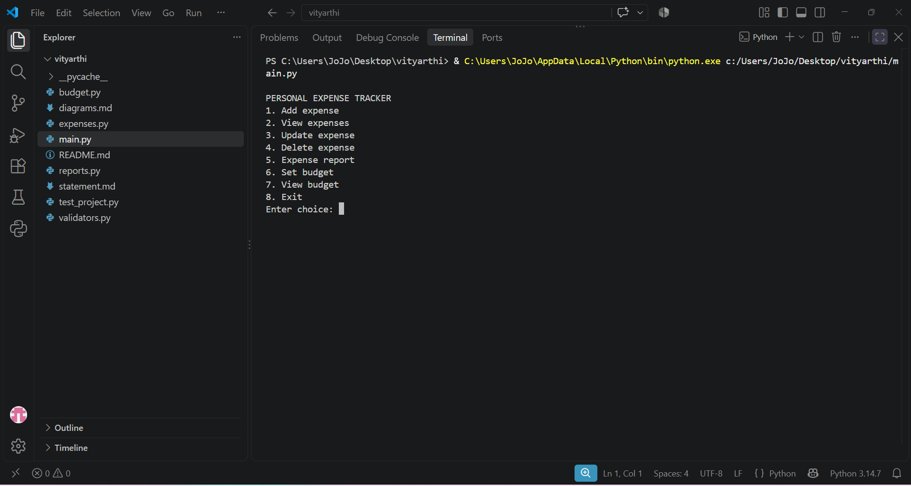
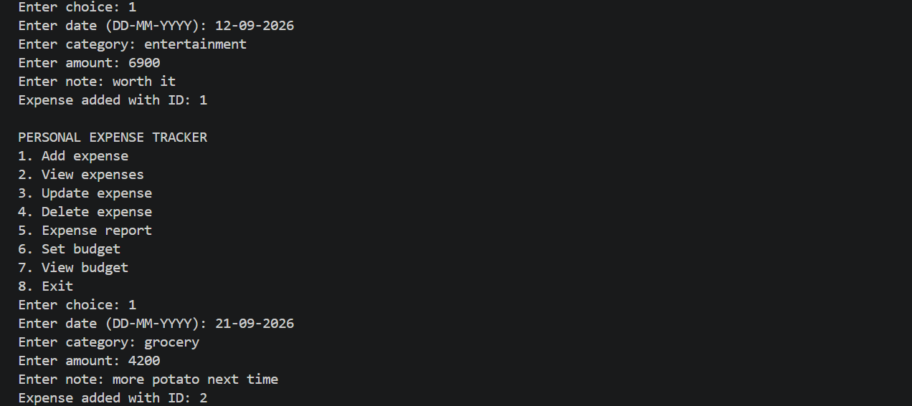
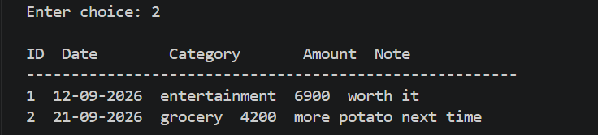
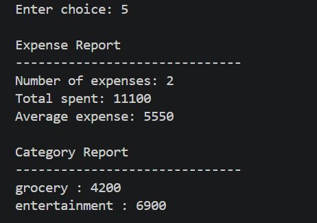
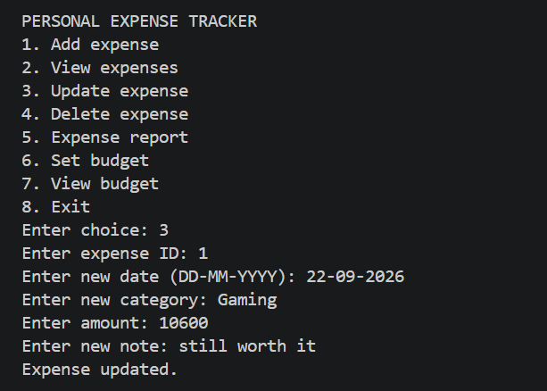
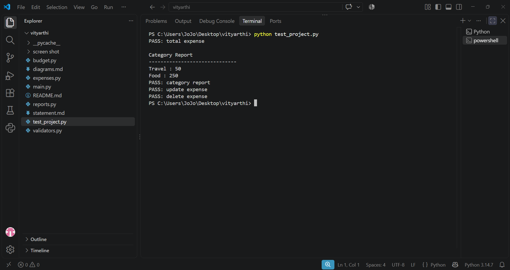

# Personal Expense Tracker

## Description

Personal Expense Tracker is a basic console application implemented in Python as part of the coursework for college. This tool will enable the user to keep track of personal expenses and get an idea of the spending habits.

This project was created using the problem-solving techniques and Python topics discussed in the syllabus during the course of the semester. The implementation is deliberately kept basic without using any external libraries or frameworks.

## Features

- Insert a new expense
- Display all expenses
- Modify an expense
- Delete an expense
- Count the number of expenses
- Compute total expense
- Compute average expense
- See expense per category
- Define budget for category
- Compare expense to the budget
- Validate critical user inputs

## Technology Used

- Python 3
- List
- Tuple
- Set
- Dictionary
- Function
- Conditional statement
- `while` and `for` loop
- Basic algorithms for counting, summation and search

No Python library is needed in this project.

## Structure of the Project

```text
PersonalExpenseTracker/
│
├── main.py
├── expenses.py
├── reports.py
├── budget.py
├── validators.py
├── test_project.py
├── .gitignore
│
├── screenshots/
│   ├── 01_main_menu.png
│   ├── 02_add_expense.png
│   ├── 03_view_expenses.png
│   ├── 04_expense_report.png
│   ├── 05_update_expense.png
│   └── 06_testing.png
│
├── README.md
├── statement.md
├── report.md
├── diagrams.md
└── PROJECT_REPORT.pdf
```

## How to Run

### 1. Install Python

Install Python 3 on your machine.

### 2. Clone the Repository

```bash
git clone <your-github-repository-url>
```

### 3. Open the Project Directory

```bash
cd PersonalExpenseTracker
```

### 4. Execute the Program

```bash
python main.py
```

## Testing

This project contains a simple test script to test important functionalities of the project.

Run:

```bash
python test_project.py
```

This test script tests the following functionalities:

- Calculation of total expenses
- Calculation based on categories
- Modification of an expense
- Deletion of an expense

Test output shows `PASS` status when the functionality is executed successfully.

## Screenshots

### 1. Main Menu



### 2. Adding an Expense



### 3. Viewing Expenses



### 4. Expense Report



### 5. Updating an Expense



### 6. Testing



## Project Scope

This version is a basic in-memory console application that can be used for personal expense tracking. No database or storage will be used.

## Syllabus Concepts Applied

The project uses some of the concepts covered during the semester, such as:

- Top down design
- Problem solving techniques
- Algorithms
- Flow control in programs
- Variables and expressions
- Functions
- Arguments and parameters
- Conditionals
- Iteration
- Lists
- Tuples
- Sets
- Dictionaries
- Counting
- Summing
- Searching
- Time trade-off

Any concept not directly related to expense tracking has not been used in the program.

## Future Enhancements

Future enhancements may include the following: storage of data permanently, graphical user interface, generation of monthly reports, and export of data after learning of other technologies needed.

## Author

**Name:** Aman Kumar
**Course:** CSE1021 
**Semester:** First Semester